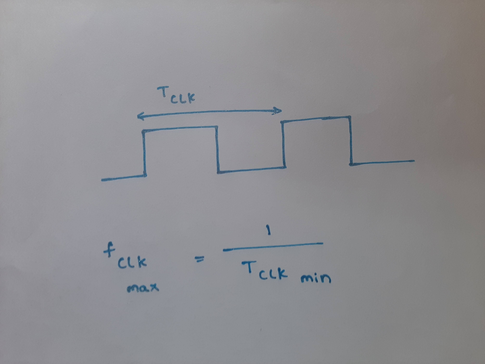

# RTL design using Verilog with SKY130 Technology<!-- omit in toc -->


Table of Contents
- [1. Introduction](#1-introduction)
- [2. Day 1 - Introduction to Verilog RTL design and Synthesis](#2-day-1---introduction-to-verilog-rtl-design-and-synthesis)
  - [2.1. Introduction to Simulation](#21-introduction-to-simulation)
    - [2.1.1. Simulation results](#211-simulation-results)
  - [2.2. Introduction to Synthesis](#22-introduction-to-synthesis)
    - [2.2.1. Yosys synthesizer flow](#221-yosys-synthesizer-flow)
      - [2.2.1.1. Read RTL design](#2211-read-rtl-design)
      - [2.2.1.2. Generic synthesis](#2212-generic-synthesis)
      - [2.2.1.3. Read Sky130 cell library](#2213-read-sky130-cell-library)
      - [2.2.1.4. Generate netlist](#2214-generate-netlist)
      - [2.2.1.5. Show](#2215-show)
- [3. Day 2 - Timing libs, hierarchical vs flat synthesis and efficient flop coding styles](#3-day-2---timing-libs-hierarchical-vs-flat-synthesis-and-efficient-flop-coding-styles)
  - [3.1. Timing libs](#31-timing-libs)
    - [3.1.1. Sky130 Process Node](#311-sky130-process-node)
    - [3.1.2. Introduction to standard cell library](#312-introduction-to-standard-cell-library)
  - [3.2. Hierarchial synthesis vs Flat synthesis](#32-hierarchial-synthesis-vs-flat-synthesis)
    - [3.2.1. Hierarchial synthesis](#321-hierarchial-synthesis)
    - [3.2.2. Selective sub-module level synthesis](#322-selective-sub-module-level-synthesis)
    - [3.2.3. Flat synthesis](#323-flat-synthesis)
  - [3.3. Various Flop coding styles and optimization](#33-various-flop-coding-styles-and-optimization)
    - [3.3.1. Optimizations](#331-optimizations)
- [4. Day 3 - Combinational and Sequential optimizations](#4-day-3---combinational-and-sequential-optimizations)
  - [4.1. Logic optimizations](#41-logic-optimizations)
    - [4.1.1. Combinational Constant propogation](#411-combinational-constant-propogation)
    - [4.1.2. Boolean logic optimization](#412-boolean-logic-optimization)
    - [4.1.3. Sequential Constant propogation](#413-sequential-constant-propogation)
  - [4.2. Logic optimizations in Yosys](#42-logic-optimizations-in-yosys)
    - [4.2.1. Optimization design example 2](#421-optimization-design-example-2)
    - [4.2.2. Optimization design example 2](#422-optimization-design-example-2)


# 1. Introduction
This is a 5-day workshop from VSD-IAT on RTL design and synthesis using open source silicon toolchains involving iVerilog, GTKWave, Yosys with Sky130 technology.  
This report is written as a part of final submission to summarize the 5-day journey through the workshop.

# 2. Day 1 - Introduction to Verilog RTL design and Synthesis
## 2.1. Introduction to Simulation
**RTL design**:
                Register Transfer Level (RTL) is a representation of the digital circuit at the abstract level.There are two elements in digital circuits: Sequential Circuit and Combinational Circuit , with the help of these two elements, a digital designer can implement any circuit.There are two commonly used variants of the RTL — namely: Verilog and VHDL, which a digital design engineer can represent their functionality of the design in a simple text entry language.
Before the RTL invention, engineers designed a complete functionality as a circuit — schematic entry, this made the design a hefty job with high level of errors.

**Simulation**: 
                RTL design is checked for adherence to its specifications by simulating the design. Simulator is the tool used for simulating the design. This helps finding and fixing bugs in the RTL design in the early stages of design development. Here in this workshop we used iverilog to achieve this.
                
iVerilog  [Icarus Verilog](http://iverilog.icarus.com/) is an open source toolchain for simulation and synthesis. But here we use it only for simulation purposes.

**Design**:
It is the actual verilog code or set of verilog codes( here in this context) which has the intended functionality to meet the requirement specifications.

**Test bench**:
Testbench is a setup to apply stimulus [(test_vectors)](https://en.wikipedia.org/wiki/Test_vector/) to design to check its functionality. Testbench doesn't have any primary inputs and outputs.

**How Simulator works ?**:

 Simulator works for changes in the input signal.
 Upon change to input, output is evaluated. If no change to input, then there will be no change to output.
 


**iVerilog based Simulation flow**:


- 1. We will apply design and testbench to iverilog.

- 2. Simulator looks for changes in input and dumps output changes into VCD file.

- 3. We use gtk wave to view vcd file.

[GTKWave](http://gtkwave.sourceforge.net/) is an open source tool for visualizing the signal dumps in .vcd/.lxt formats.  

# iverilog Set-up:
- open terminal and create a root directory to work-in
- Here are the commands to Get started

  ```
   mkdir vlsi
   cd vlsi
   mkdir vsdflow
   git clone  https://github.com/kunalg123/sky130RTLDesignAndSynthesisWorkshop.git
   
   ```
- Now to Check the Content Enter

   ```
      cd vlsi
      cd vsdflow
      ls 
      cd sky130RTLDesignAndSynthesisWorkshop
      ls -ltr
      cd my_lib
      ls
      cd lib   :This file contain the  Sky130 Standard Cell library
      cd ..
      cd verilog_model :Content of verilog models
      
   ```

The images are as follows:


#  Simulation Using iverilog. <br/>
-  1. Into iverilog simulator, RTL file and Test-bench files are passed. Then "a.out" file is generated <br/>

```
iverilog good_mux.v tb_good_mux.v

```
-  2.Now to get the .vcd file <br/>

```
./a.out

```
- 3.To view the waveform for logical verification run the .vcd file with gtkwave <br/>

``` 
 gtkwave tb_good_mux.vcd
 
 ```

The images and results are as follows:


# Introduction to Yosys

 **Synthesis**:</br>
There is a need of tool to convert RTL to netlist.


- RTL to gate level translation will be performed by snthesis.
- Design is converted into gates and connections made between gates.
- This is given out as a file called netlist.

The working may look as follows:


**what is .lib ?**

- Collection of logical modules is a .lib file.
- It includes basic gates like and,or,not etc.
- Different flavors of some gates (2 i/p, 3 i/p, slow, fast etc)will be available. </br>

**Why different flavors of gate ?** </br>
Combinational delay in logic path determine maximum speed of operation of digital logic circuit.So we need cells that work fast to make T_comb small.




**Are faster cells sufficient ?** </br>

To ensure there are no hold issues at Dff_B, we need cells that work slow.


So from figure, we can observe  what DFF_A launched should be captured by DFF_B in next cycle. Else,we will lose data. So, we need hold time.
Hence we need cells that work fast to meet required performance and we need cells to work slow to meed hold.</br>
This collection forms .lib file.

**Faster cells vs Slower cells:** </br>
Load in digital circuit can be inferrred as capacitance.
- faster the charging/discharging of capacitance, lesser the delay of cell.
- To charge/discharge capacitor fast, we need transistors that are capable of sourcing more current.</br>

wider transistors ----> low delay ----> more area and power </br>
narrow transistors ----> more delay ----> less area and power </br>

Therefore, we can understand that faster cells come at the penalty of area and power.

**Selection of cells:**</br>
- Need to guide synthesizer to select flavor of cells that is optimum for implementation of logic circuit.
- More use of faster cells cause bad circuit in terms of power and area. It may also cause hold time violatons.
- More use of slower cells may cause sluggish circuit and may not meet performance needs.</br>
The guidance offered to synthesizer is known as **constraints**.


