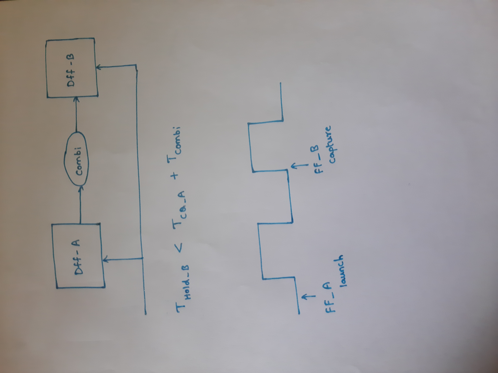
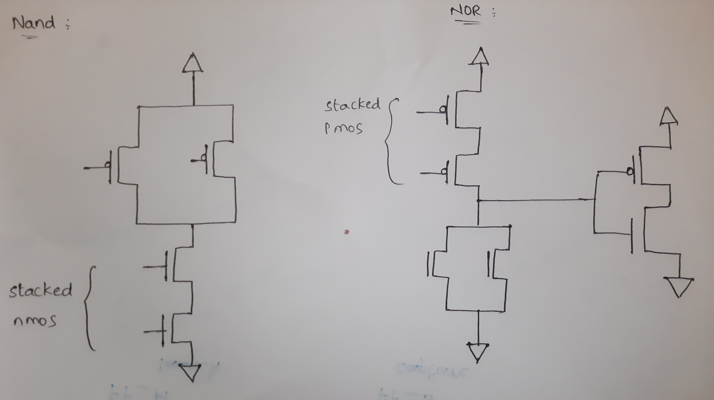

# RTL design using Verilog with SKY130 Technology<!-- omit in toc -->


Table of Contents
- [1. Introduction](#1-introduction)
- [2. Day 1 - Introduction to Verilog RTL design and Synthesis](#2-day-1---introduction-to-verilog-rtl-design-and-synthesis)
  - [2.1. Introduction to Simulation](#21-introduction-to-simulation)
    - [2.1.1. Simulation results](#211-simulation-results)
  - [2.2. Introduction to Synthesis](#22-introduction-to-synthesis)
    - [2.2.1. Synthesis using yosys](#221-Synthesis-using-yosys)
      - [2.2.1.1. Read RTL design](#2211-read-rtl-design)
      - [2.2.1.2. Generic synthesis](#2212-generic-synthesis)
      - [2.2.1.3. Read Sky130 cell library](#2213-read-sky130-cell-library)
      - [2.2.1.4. Generate netlist](#2214-generate-netlist)
      - [2.2.1.5. Show](#2215-show)
      - [2.2.1.6. write verilog](#2216-write-verilog)
      - [2.2.1.7. Netlist](#2217-Netlist)

- [3. Day 2 - Timing libs, hierarchical vs flat synthesis and efficient flop coding styles](#3-day-2---timing-libs-hierarchical-vs-flat-synthesis-and-efficient-flop-coding-styles)
  - [3.1. Timing libs](#31-timing-libs)
    - [3.1.1. Sky130 Process Node](#311-sky130-process-node)
    - [3.1.2. Introduction to standard cell library](#312-introduction-to-standard-cell-library)
  - [3.2. Hierarchial synthesis vs Flat synthesis](#32-hierarchial-synthesis-vs-flat-synthesis)
    - [3.2.1. Hierarchial synthesis](#321-hierarchial-synthesis)
    - [3.2.2. Selective sub-module level synthesis](#322-selective-sub-module-level-synthesis)
    - [3.2.3. Flat synthesis](#323-flat-synthesis)
  - [3.3. Various Flop coding styles and optimization](#33-various-flop-coding-styles-and-optimization)
    - [3.3.1. Optimizations](#331-optimizations)
- [4. Day 3 - Combinational and Sequential optimizations](#4-day-3---combinational-and-sequential-optimizations)
  - [4.1. Logic optimizations](#41-logic-optimizations)
    - [4.1.1. Combinational Constant propogation](#411-combinational-constant-propogation)
    - [4.1.2. Boolean logic optimization](#412-boolean-logic-optimization)
    - [4.1.3. Sequential Constant propogation](#413-sequential-constant-propogation)
  - [4.2. Logic optimizations in Yosys](#42-logic-optimizations-in-yosys)
    - [4.2.1. Optimization design example 2](#421-optimization-design-example-2)
    - [4.2.2. Optimization design example 2](#422-optimization-design-example-2)
- [3. Day 4 - Timing libs, hierarchical vs flat synthesis and efficient flop coding styles](#3-day-2---timing-libs-hierarchical-vs-flat-synthesis-and-efficient-flop-coding-styles)
  - [3.1. Timing libs](#31-timing-libs)
    - [3.1.1. Sky130 Process Node](#311-sky130-process-node)
    - [3.1.2. Introduction to standard cell library](#312-introduction-to-standard-cell-library)
  - [3.2. Hierarchial synthesis vs Flat synthesis](#32-hierarchial-synthesis-vs-flat-synthesis)
    - [3.2.1. Hierarchial synthesis](#321-hierarchial-synthesis)
    - [3.2.2. Selective sub-module level synthesis](#322-selective-sub-module-level-synthesis)
    - [3.2.3. Flat synthesis](#323-flat-synthesis)
  - [3.3. Various Flop coding styles and optimization](#33-various-flop-coding-styles-and-optimization)
    - [3.3.1. Optimizations](#331-optimizations)
- [6. Day 5 - If Case For Generate](#4-day-3---combinational-and-sequential-optimizations)
  - [6.1. If statement](#41-logic-optimizations)
  
    - [6.1.1. If ](#411-combinational-constant-propogation)
    - [6.1.2. else if](#411-combinational-constant-propogation)
    - [6.1.3. Danger with If](#411-combinational-constant-propogation)
   
  - [6.2. Case statement](#42-logic-optimizations-in-yosys)
    - [6.2.1. Caveat with case](#421-optimization-design-example-2)
    - [6.2.2. Caveat with case2](#422-optimization-design-example-2)
    - [6.2.3. Incomplete case](#422-optimization-design-example-2)
   - [6.3. For vs For Generate](#42-logic-optimizations-in-yosys)
     - [6.2.1. Caveat with case](#421-optimization-design-example-2)


# 1. Introduction
This is a 5-day workshop from VSD-IAT on RTL design and synthesis using open source silicon toolchains involving iVerilog, GTKWave, Yosys with Sky130 technology.  
This report is written as a part of final submission to summarize the 5-day journey through the workshop.

# 2. Day 1 - Introduction to Verilog RTL design and Synthesis
## 2.1. Introduction to Simulation
**RTL design**:
                Register Transfer Level (RTL) is a representation of the digital circuit at the abstract level.There are two elements in digital circuits: Sequential Circuit and Combinational Circuit , with the help of these two elements, a digital designer can implement any circuit.There are two commonly used variants of the RTL — namely: Verilog and VHDL, which a digital design engineer can represent their functionality of the design in a simple text entry language.
Before the RTL invention, engineers designed a complete functionality as a circuit — schematic entry, this made the design a hefty job with high level of errors.

**Simulation**: 
                RTL design is checked for adherence to its specifications by simulating the design. Simulator is the tool used for simulating the design. This helps finding and fixing bugs in the RTL design in the early stages of design development. Here in this workshop we used iverilog to achieve this.
                
iVerilog  [Icarus Verilog](http://iverilog.icarus.com/) is an open source toolchain for simulation and synthesis. But here we use it only for simulation purposes.

**Design**:
It is the actual verilog code or set of verilog codes( here in this context) which has the intended functionality to meet the requirement specifications.

**Test bench**:
Testbench is a setup to apply stimulus [(test_vectors)](https://en.wikipedia.org/wiki/Test_vector/) to design to check its functionality. Testbench doesn't have any primary inputs and outputs.

**How Simulator works ?**:

 Simulator works for changes in the input signal.
 Upon change to input, output is evaluated. If no change to input, then there will be no change to output.
 


**iVerilog based Simulation flow**:


- 1. We will apply design and testbench to iverilog.

- 2. Simulator looks for changes in input and dumps output changes into VCD file.

- 3. We use gtk wave to view vcd file.

[GTKWave](http://gtkwave.sourceforge.net/) is an open source tool for visualizing the signal dumps in .vcd/.lxt formats.  

# iverilog Set-up:
- open terminal and create a root directory to work-in
- Here are the commands to Get started

  ```
   mkdir vlsi
   cd vlsi
   mkdir vsdflow
   git clone  https://github.com/kunalg123/sky130RTLDesignAndSynthesisWorkshop.git
   
   ```
- Now to Check the Content Enter

   ```
      cd vlsi
      cd vsdflow
      ls 
      cd sky130RTLDesignAndSynthesisWorkshop
      ls -ltr
      cd my_lib
      ls
      cd lib   :This file contain the  Sky130 Standard Cell library
      cd ..
      cd verilog_model :Content of verilog models
      
   ```

The images are as follows:


#  Simulation Using iverilog. <br/>
-  1. Into iverilog simulator, RTL file and Test-bench files are passed. Then "a.out" file is generated <br/>

```
iverilog good_mux.v tb_good_mux.v

```
-  2.Now to get the .vcd file <br/>

```
./a.out

```
- 3.To view the waveform for logical verification run the .vcd file with gtkwave <br/>

``` 
 gtkwave tb_good_mux.vcd
 
 ```

The images and results are as follows:


# Introduction to Yosys

 **Synthesis**:</br>
There is a need of tool to convert RTL to netlist.


- RTL to gate level translation will be performed by snthesis.
- Design is converted into gates and connections made between gates.
- This is given out as a file called netlist.

The working may look as follows:


**what is .lib ?**

- Collection of logical modules is a .lib file.
- It includes basic gates like and,or,not etc.
- Different flavors of some gates (2 i/p, 3 i/p, slow, fast etc)will be available. </br>

**Why different flavors of gate ?** </br>
Combinational delay in logic path determine maximum speed of operation of digital logic circuit.So we need cells that work fast to make T_comb small.


**Are faster cells sufficient ?** </br>

To ensure there are no hold issues at Dff_B, we need cells that work slow.


So from figure, we can observe  what DFF_A launched should be captured by DFF_B in next cycle. Else,we will lose data. So, we need hold time.
Hence we need cells that work fast to meet required performance and we need cells to work slow to meed hold.</br>
This collection forms .lib file.

**Faster cells vs Slower cells:** </br>
Load in digital circuit can be inferrred as capacitance.
- faster the charging/discharging of capacitance, lesser the delay of cell.
- To charge/discharge capacitor fast, we need transistors that are capable of sourcing more current.</br>

wider transistors ----> low delay ----> more area and power </br>
narrow transistors ----> more delay ----> less area and power </br>

Therefore, we can understand that faster cells come at the penalty of area and power.

**Selection of cells:**</br>
- Need to guide synthesizer to select flavor of cells that is optimum for implementation of logic circuit.
- More use of faster cells cause bad circuit in terms of power and area. It may also cause hold time violatons.
- More use of slower cells may cause sluggish circuit and may not meet performance needs.</br>
The guidance offered to synthesizer is known as **constraints**.

### 2.2.1. Synthesis using yosys

#### 2.2.1.1. Read RTL design

-  To invoke Yosys:
   ```
    cd verilog_files
    $ yosys
    
   ```

</br>


#### 2.2.1.2. Generic synthesis
 ```
 $  synth -top good_mux
 
 ```


</br>

</br>
synth[options]: This command runs the default synthesis script. This command does not operate on partly selected designs[].  


#### 2.2.1.3. Read Sky130 cell library
      
  ```
   $ read_liberty -lib ../my_lib/lib/sky130_fd_sc_hd__tt_025C_1v80.lib  
  
  ```

</br>  
  read_liberty[options]: This command reads cells from liberty file as modules into current design[].  
  
  **read_verilog**</br>
    </br>

  
</br>
  
  

#### 2.2.1.4. Generate netlist
  ```
  
  $  abc -liberty ../my_lib/lib/sky130_fd_sc_hd__tt_025C_1v80.lib

   ```
     

   
</br>
   

  </br>

abc[options]: This pass uses the ABC tool [1] for technology mapping of yosys's internal gate library to a target architecture[].  
 
**Note**: When no target cell library is specified the Yosys standard cell library is loaded into abc before the abc script is executed.  


#### 2.2.1.5. Show

 ```
  $ show
  
  ```
</br>

  
  </br>
   

</br>
- To view the result as a grapviz use above command 
#### 2.2.1.6. write verilog

  ```
  $ write_verilog -noattr good_mux_netlist.v
  
  ```
   
</br>
- write_verilog      : Write the netlist to a file :

- -noattr            : By using this option no attributes are included in the output. </br>
- good_mux_netlist.v : File name to which we want to write the netlist.

#### 2.2.1.7. Netlist
    ```
     $ !gvim good_mux_netlist.v
    
    ```

</br>
- To view netlist we can use above command.<br/>


The netlist file will be as follows:
 ```
    /* Generated by Yosys 0.7 (git sha1 61f6811, gcc 6.2.0-11ubuntu1 -O2 -fdebug-prefix-map=/build/yosys-OIL3SR/yosys-0.7=. -fstack-protector-strong -fPIC -Os) */

  module good_mux(i0, i1, sel, y);
  wire _0_;
  wire _1_;
  wire _2_;
  wire _3_;
  wire _4_;
  wire _5_;
  input i0;
  input i1;
  input sel;
  output y;
  sky130_fd_sc_hd__clkinv_1 _6_ (
    .A(_0_),
    .Y(_4_)
  );
  sky130_fd_sc_hd__nand2_1 _7_ (
    .A(_1_),
    .B(_2_),
    .Y(_5_)
  );
  sky130_fd_sc_hd__o21ai_0 _8_ (
    .A1(_2_),
    .A2(_4_),
    .B1(_5_),
    .Y(_3_)
  );
  assign _0_ = i0;
  assign _1_ = i1;
  assign _2_ = sel;
  assign y = _3_;
 endmodule  
 
 ```
# 3. Day 2 - Timing libs, hierarchical vs flat synthesis and efficient flop coding styles
## 3.1. Timing libs
### 3.1.1. Sky130 Process Node
- The Standard cell library :
- The Library files We are Using Here are Sky130 Process Node:
- About Sky130 Process Node:The SKY130 is a mature 180nm-130nm hybrid technology originally developed internally by Cypress Semiconductor before being spun out into     SkyWater Technology and made accessible to general industry.  
 
    ```
    
    $  gvim Sky130_fd_scSky130_fd_sc_hd_tt_025C_1v80.lib  
 
   ```

### 3.1.2. Introduction to standard cell library
Nomenclature is as follows:


- To search individual  Standard cells in library use the following Commands.

```

:syn off     //to turn off the syntax
:se nu     //To show numbers
:/cell     //search for "cell"
:g//       //list all

```


Here the example of standard cell library is as follows:


</br>


</br>

</br>


## 3.2. Hierarchial synthesis vs Flat synthesis
### 3.2.1. Hierarchial synthesis

In hierarchial synthesis the hierarchy of the RTL design is preserved through the final netlist. Let us look at the below RTL design where we have two sub modules, both instantiated by a top modules.  


we can see sub modules 1 and 2 here:


**Stacked nMos vs Stacked pMos:**


- pMos has poor mobility, to improve it we have to make cells larger.
- Stacked pmos is bad.
- so we get nand based gates in this synthesis.
### 3.2.2. Why to synth only sub module ?
Just like synthesizing an RTL design at the top mudule level, it can be synthesized at the sub-module level as well. This level of freedom brings the below advantsges.  
* &emsp;  Multiple instantions: In case of having multiple instantiations in our design, this feature helps to synthesize just one instance and use it iteratively throughout the top level.    
* &emsp;  Massive desgins: In case of massive design, sub-module level synthesis reduces the burden on sythesis tool in-terms of performance and time.  
 
We can take a look at the same example of multiple_modules.v.  Let us synthesize only sub_module1 and see how the final netlist appears.  
We can see that the synth command just looks at the specified sub_module1 alone and sub_module2 is ommitted from synthesis.  

- when we have multiple instance of same module.
- To divide and conquer a massive design.
 
- 
**flatten** :</br>This pass flattens the design by replacing cells by their implementation. 
</br>
Cells and/or modules with the 'keep_hierarchy' attribute set will not be flattened by this command." [source: http://yosyshq.net/yosys/cmd_flatten.html]  

As the name suggestes this pass flattens out the design and hence the hierarchy is lost.  
Let us observe the impact of 'flatten' on multiple_modules.v.  
  
</br>


We can see that the submodules were deleted and hierarchy is no longer preserved. 


## 3.3. How to code a flop ?
- abc tool maps only the combinational logic cells from the liberty. It doesn't look for the register cells. 
-  If the RTL design has sequential logic, dfflibmap pass has to be executed before abc pass.
-  dfflibmap pass looks for the register cells in the Liberty and maps to the sequential logic from the synthesis. And then abc pass has to used to complete the mapping for combinatorial logic.  
** why flop?**
 
 

- More combinational circuit means more glitch
- we need element to store, i.e flop
- flop will be stable, it changes only at the edge of clock.
- As output changes only at the edge of the clock. So even if input glitching, output will be calmed down.
 

**why set and Reset pins?**
   - If initial state of flop is unknown,it will take garbage value.
   - So we use set and reset pins.
   - **Asynchronous reset** wont wait for the clock </br>
   - If both set and reset are present, this may leads to **race-around** condition.</br>
**One of the example for asynchronous reset is:**
 
 
 


 

**Optimisation**
  ```

    module mul2(input[2:0]a,output[3:0]y); 
           assign y=a*2;
    endmodule
 
   ```


   Here the last bit getting appended by zero as logic.
   - Therefore, multiply by 2 means  ----> append by zero
   - Therefore, multiply by 4 means  ----> append by 2 zeros
   - Therefore, multiply by 8 means  ----> append by 3 zeros

# Day 3:Combinational And Synthesis Optimisation:
## Intro To  Optimisation:
## Combinational  Logic Optimisation :
    
 -  opt_check.v
 
    ```
    module opt_check (input a , input b , output y);
	assign y = a?b:0;
    endmodule 
     
     ```
     - Here is the Circuit without optimisation:
  
     
      
 - The following command Removes the unused Wires:
    
    ``` 
    opt_clean -purge
    
    ```
  The results are as follows:
 
  
 
  
  - opt_check2: 
 
 


###  Multiple_modules_opt In Hier Vs flat:<br/>
-  UnderExcerise <br/>
   Here are the verilog_files associated with Mutliple Modules for Optimisation: <br/>
   
-  Verilog Code For Multiptle_modules_opt:
- 
   ```
   module sub_module1(input a , input b , output y);
   assign y = a & b;
   endmodule


   module sub_module2(input a , input b , output y);
   assign y = a^b;
   endmodule


   module multiple_module_opt(input a , input b , input c , input d , output y);
   wire n1,n2,n3;

   sub_module1 U1 (.a(a) , .b(1'b1) , .y(n1));
      sub_module2 U2 (.a(n1), .b(1'b0) , .y(n2));
      sub_module2 U3 (.a(b), .b(d) , .y(n3));

     assign y = c | (b & n1); 


     endmodule
     
   ```
   Synthesis Report:
   
   ```
   3.25. Printing statistics.

    === sub_module1 ===

    Number of wires:                  3
    Number of wire bits:              3
    Number of public wires:           3
    Number of public wire bits:       3
    Number of memories:               0
    Number of memory bits:            0
    Number of processes:              0
    Number of cells:                  1
      $_AND_                          1

    === multiple_module_opt ===

    Number of wires:                  7
    Number of wire bits:              7
    Number of public wires:           6
    Number of public wire bits:       6
    Number of memories:               0
    Number of memory bits:            0
    Number of processes:              0
    Number of cells:                  3
      $_AND_                          1
      $_OR_                           1
      sub_module1                     1
 
    === design hierarchy ===

    multiple_module_opt               1
      sub_module1                     1

    Number of wires:                 10
    Number of wire bits:             10
    Number of public wires:           9
    Number of public wire bits:       9
    Number of memories:               0
    Number of memory bits:            0
    Number of processes:              0
    Number of cells:                  3
      $_AND_                          2
      $_OR_                           1

   ```
-  With opt_clean -purge vs without:<br/>
   With Clean:<br/>
     
     
     

-  Without clean:<br/>

  
   
- Multiple_module_opt2 hier vs Flatten:<br/>
- Similarly Hier with Multiple_module_opt2 :<br/>

- Flatten multiple_module_opt2:
 
 
   

##  Seqential Logic Optimisation:
##  Sequential Optimisation:
-  Verilog Files for Sequential circuits assciated with D flip Flop:

- dff_const1.v 
  
  ```
  
  module dff_const1(input clk, input reset, output reg q);   
   always @(posedge clk, posedge reset) 
   begin
	if(reset)
		q <= 1'b0;
	else
		q <= 1'b1;
    end

    endmodule
  
  
  ```
  
- It clearly Show the design follows a Clock.
- So there is the synthesis Result expected as expected:
  
  
 
   
    ```
     dfflibmap  ./my_lib/lib/sky130_fd_sc_hd__tt_025C_1v80.lib
    
    ```
    
-  DFF mapping:   
   
     

- Here are the 
   dff_const4.v
   
   ```
   module dff_const4(input clk, input reset, output reg q);
    reg q1;

    always @(posedge clk, posedge reset)
    begin
	if(reset)
	begin
		q <= 1'b1;
		q1 <= 1'b1;
	end
	  else
	     begin
		q1 <= 1'b1;
		q <= q1;
	   end
          end

     endmodule
     
   ```
   
- dff_const5.v
 
 ```

 module dff_const5(input clk, input reset, output reg q);
 reg q1;

 always @(posedge clk, posedge reset)
 begin
	if(reset)
	begin
		q <= 1'b0;
		q1 <= 1'b0;
	end
	else
	begin
		q1 <= 1'b1;
		q <= q1;
	end
 end

 endmodule
 
```

#5 Day 4 Gate Level Simulation
## 5.1.1 What is GLS?
- Running test bench with netlist as DUT.
- Netlist is logically same as RTL code 
- same test bench align with design too
### 5.1.2 Why GLS?
- verifying the logical correctness of design after synthesis.
- Ensuring the timing of design is met.
- For this GLS we need to be run with delay annotation.
###5.1.3 GLS using iverilog:
If gate level models are delay annotated, then we can use GLS for timing violation

## 5.2 Blocking vs Non-Blocking statements:

 **Blocking**
    - Executes the statement in the order it is written
    - So the first statement is evaluated before the second statement

 **Non-blocking**
    - Executes all the RHS when always BLOCK is entered and assigns to LHS
    - Parallel evaluation
## 5.3 Synthesis Simulation Mismatch
### 5.3.1 Reasons:
- Missing sensitivity list
- Blocking vs non-blocking
- non standard verilog coding
**How simulator works?**
Simulator works based on activity. A change in input only can cause change in output.

**Ternary_mux:**
  ```
    module ternary_operator_mux (input i0 , input i1 , input sel , output y);
	assign y = sel?i1:i0;
	endmodule
   ```
   
   
   
  
  
**good_mux**

    ```
    
    module good_mux (input i0 , input i1 , input sel , output reg y);
      always @ (*)
      begin
	if(sel)
		y <= i1;
	else 
		y <= i0;
        end
      endmodule
      
    ```


**bad_mux**

      ```
      module bad_mux (input i0 , input i1 , input sel , output reg y);
      always @ (sel)
       begin
       if(sel)
		y <= i1;
	  else 
	  	y <= i0;
        end
         endmodule
   
      ```


 #6. Day 5 - If Case For Generate
 
 
 ##6.1 If statement
  ###6.1.1 If:

   ```

  if <cond>
       begin
         ---------
         ---------
         ---------
         ---------
       end
  else
       begin
         ---------
         ---------
         ---------
         ---------
      end
  
 
   ```

If is used as a priority logic. Above code is example for normal if and else statement.</br>


 ##6.1.2 else if statement:
 
 There is another kind of if else, where we can use else-if. The example is followed below:

 
 
   ```

  if <condition 1>
       begin
         ---------
         ---------
         ---------
         ---------
       end
   else if <condition 2>
       begin
         ---------
         ---------
         ---------
         ---------
      end
    else if<condition 3>
       begin
         ---------
         ---------
         ---------
         ---------
      end
  else
       begin
         ---------
         ---------
         ---------
         ---------
      end
  
 
   ```
Multiple conditions can be checked through else if statement.


###6.1.3 Danger with If

-Incomplete if statments cause Inferred latches(This is a bad coding style)
-In combinational circuits, inferred latches are dangerous.
- The example is as below:

 ```

  if <cond>
       begin
         ---------
         ---------
         ---------
         ---------
       end
  else if <cond 2>
       begin
         ---------
         ---------
         ---------
         ---------
      end
  
 
   ```
   
   
   
 **Exception to Inferred latch:**
 - consider counter as example, here inferred latches are needed.
```
reg[2:0] count
always@(posedge clk, posedge reset)
begin
  if (reset)
       begin
            count<=3'b000;
       end
  else if (en)
       begin
         count<= count +1;
       end
end
 
   ```
   
- The results for incomplete if case are as follows:   


##6.2 case statement
- If and case statements are always used inside 'always' block.
- Their output should be as reg variable.
- The example is as follows:
```
reg y
always@(*)
begin
  case(sel)
       2'b00: begin
                  -------
                  -------
               end
        2'b01: begin
                  -------
                  -------
               end
       endcase
end 
   ```
###6.3.3 Coveat with case:
- Incomplete case results in inferred latches
```
reg y
always@(*)
begin
  case(sel)
       2'b00: begin
                  
                  x=a;
                  y=b;
               end
        2'b01: begin
                  x=c;
                  y=d;
                  end
       endcase
end 
   ```
- The above is incomplete, it will result in inferred latch.
- To avoid inferred latches, we code case with 'default'
```
reg y
always@(*)
begin
  case(sel)
       2'b00: begin
       
                  x=a;
                  y=b;
              end
        2'b01: begin
                  x=d;
                  y=e;
               end
       default: begin
                  x=f;
                  y=d;
               end
       endcase
end 
   ```
###6.2.2 caveat with case 2
- Partial assignments will lead to inferred latches
- The example will be as follows:
```
reg [1:0] sel;
reg x,y;
always@(*)
begin
  case(sel)
       2'b00: begin
                 x=a;
                 y=b;
               end
        2'b01: begin
                  x=c;
                end
       default: begin
                  x=d;
                  y=b;
               end
       endcase
end 
   ```
   
   
**Note**:
- Assign all outputs in all segments of case.
- We can get unpredictable output throgh case statement.
- Bad cases can match in case statement.


- We should avoid overlapping cases while using case statement.
**Example of complete case with figures**
 


